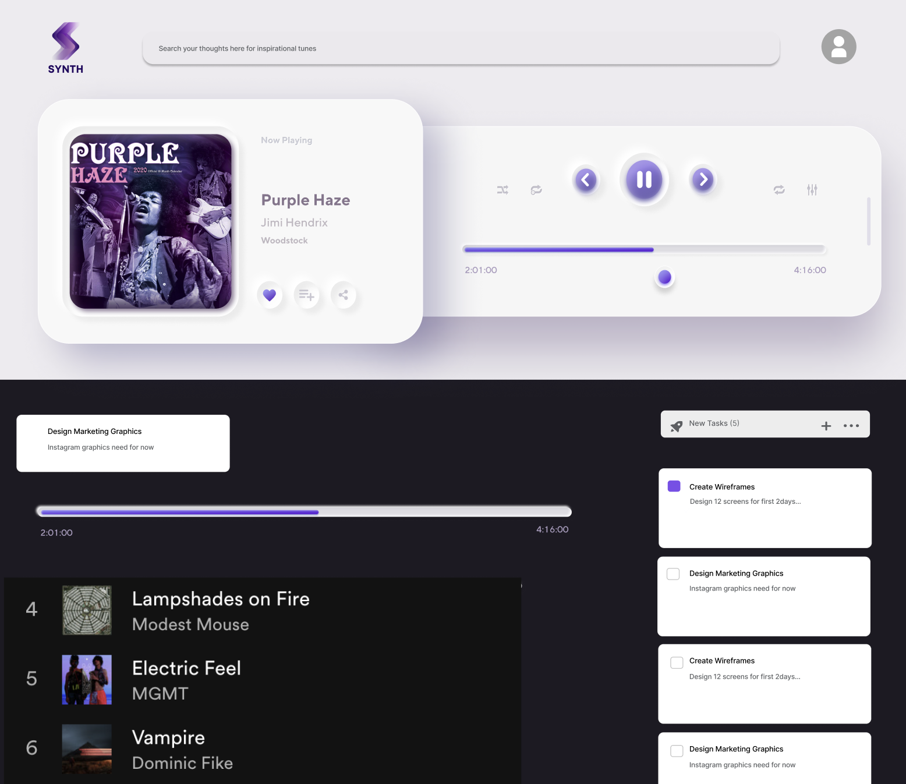
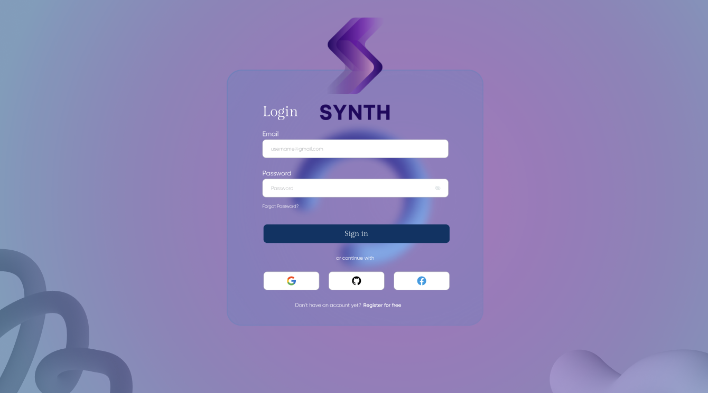
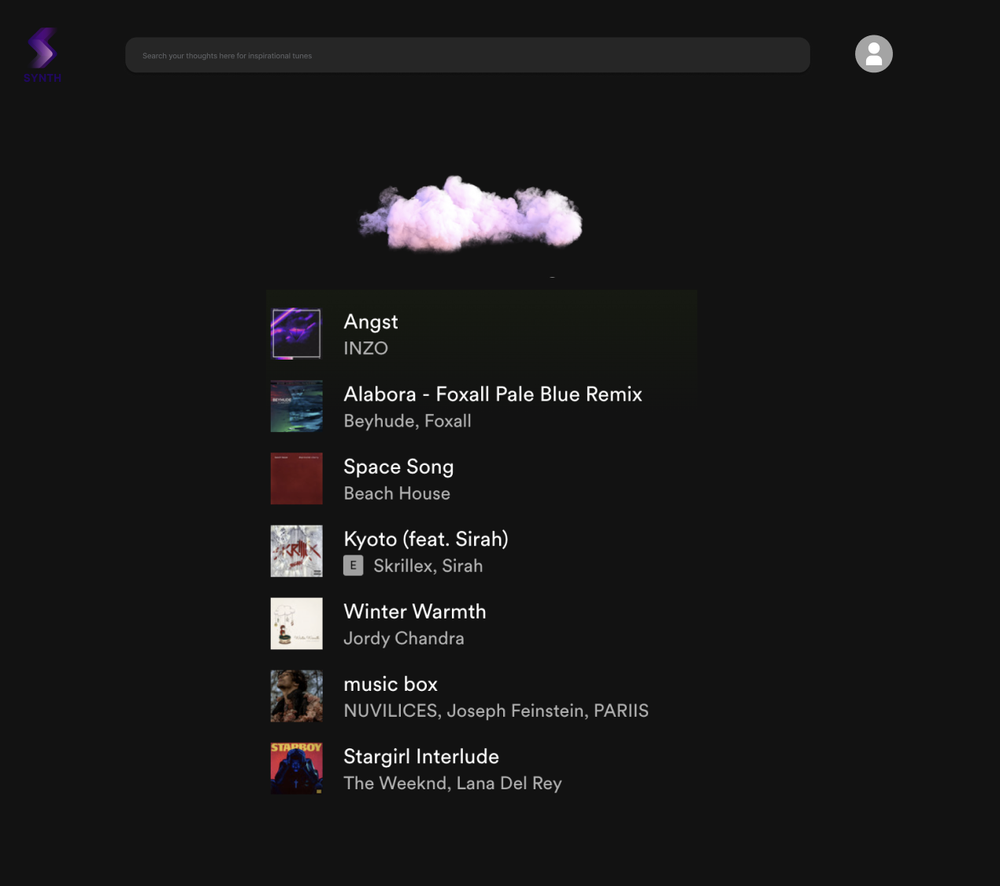
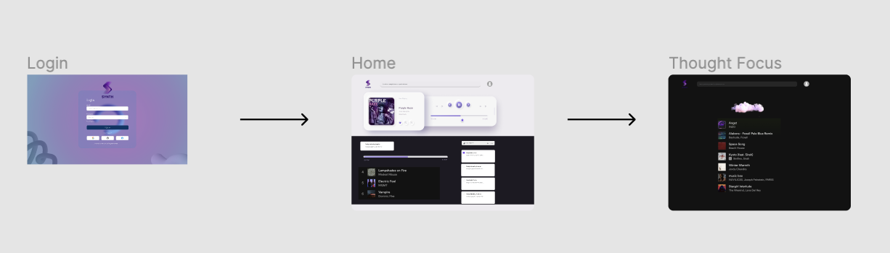

The content below is an example project proposal / requirements document. Replace the text below the lines marked "__TODO__" with details specific to your project. Remove the "TODO" lines.

(__TODO__: Synth)

# TaskTune

## Overview

(__TODO__: a brief one or two paragraph, high-level description of your project)

Synth is an innovative application that integrates task management with the world of trending music. By understanding the duration of a user's task, Synth curates a playlist of trending songs that lasts for the entire span of the task, offering a seamless blend of productivity and entertainment.


## Data Model

(__TODO__: a description of your application's data and their relationships to each other) 

The application will store Users, Lists and Items

* users can have multiple lists (via references)
* each list can have multiple items (by embedding)

(__TODO__: sample documents)

An Example User:

```javascript
{
  username: "isabel123",
  hash: "hashedpassword1234",  // Placeholder for a password hash
  tasks: [ObjectId('5f50a1f116861d2a44c10b32'), ObjectId('5f50a1f116861d2a44c10b35')]  // Array of references to Task documents
}
```

An Example List with Embedded Items:

```javascript
{
  user: ObjectId('5f50a1f116861d2a44c10b33'),  // Reference to a User document
  name: "Study for History Exam",
  duration: "2 hours",
  playlist: [
    { songName: "Song A", artist: "Artist X", duration: "4:00"},
    { songName: "Song B", artist: "Artist Y", duration: "3:30"},
    // ... More songs such that total duration is close to 2 hours
  ],
  createdAt: "2023-01-05T14:18:00Z"  // Timestamp
}
```


## [Link to Commented First Draft Schema](db.mjs) 

(__TODO__: create a first draft of your Schemas in db.mjs and link to it)

## Wireframes

(__TODO__: wireframes for all of the pages on your site; they can be as simple as photos of drawings or you can use a tool like Balsamiq, Omnigraffle, etc.) 

created using figma

/list/create - page for saving songs, "thought tasks"


/list - page for login



/list/slug - page for finding songs with keywords of moods




## Site map
(__TODO__: draw out a site map that shows how pages are related to each other)




## User Stories or Use Cases

(__TODO__: write out how your application will be used through [user stories](http://en.wikipedia.org/wiki/User_story#Format) and / or [use cases](https://en.wikipedia.org/wiki/Use_case))

1. As a non-registered user, I want to register a new account with Synth so that I can manage my tasks with music.
2. As a user, I want to log in to Synth to view and manage my tasks.
3. As a user, I want to create a new task and get a playlist tailored to its duration for an immersive work experience.
4. As a user, I want to view all my tasks and their associated playlists on a dashboard for easy navigation.
5. As a user, I want to modify a task's details and update its associated playlist as required.
6. As a user, I want to mark a task as completed and archive its playlist for future reference.

## Research Topics

(__TODO__: the research topics that you're planning on working on along with their point values... and the total points of research topics listed)

I will use all 3 of these:
* (5 points) Integrate user authentication
    * I'm going to be using passport for user authentication
    * And account has been made for testing; I'll email you the password
    * see <code>cs.nyu.edu/~jversoza/ait-final/register</code> for register page
    * see <code>cs.nyu.edu/~jversoza/ait-final/login</code> for login page
* (4 points) Perform client side form validation using a JavaScript library
    * see <code>cs.nyu.edu/~jversoza/ait-final/my-form</code>
    * if you put in a number that's greater than 5, an error message will appear in the dom
* (5 points) vue.js
    * used vue.js as the frontend framework; it's a challenging library to learn, so I've assigned it 5 points

10 points total out of 8 required points (___TODO__: addtional points will __not__ count for extra credit)


## [Link to Initial Main Project File](app.mjs) 

(__TODO__: create a skeleton Express application with a package.json, app.mjs, views folder, etc. ... and link to your initial app.mjs)

## Annotations / References Used

(__TODO__: list any tutorials/references/etc. that you've based your code off of)

JWT Authentication Tutorial - Used for understanding and integrating JWT authentication.
Vuelidate Library - Used for client-side form validation in Vue.
Vue.js Official Guide - Main reference for building the frontend.

